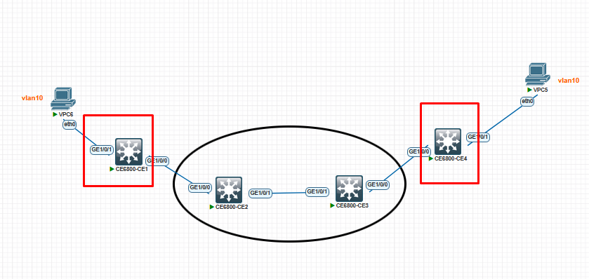

````markdown
# Encapsulamento QinQ 802.1ad



Configure normalmente os switches, colocando as portas em **access** e **trunk** conforme o cenário.

## Configuração da interface que conecta ao switch de acesso do cliente

```text
vlan 1001
[~HUAWEI-vlan1001] description EMPRESA VERDE

interface GE1/0/0
 port link-type dot1q-tunnel
 port default vlan 1001
````

## Configuração da interface que conecta ao outro switch

```text
interface GE1/0/1
 qinq protocol 9100
 port link-type trunk
 port trunk allow-pass vlan 1001
```

```

Se quiser, posso:
- Padronizar o texto para documentação técnica  
- Adaptar para outro fabricante (Cisco, Juniper, etc.)  
- Explicar o funcionamento do QinQ passo a passo
```
